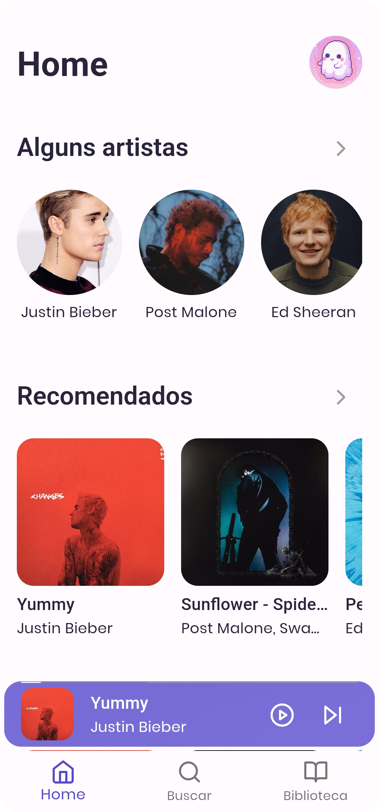

:construction: Projeto em desenvolvimento !! :construction:

<h2 align="center">
  

  symphony
  

</h2>

  
  
  
  
  
  

  

    
    
  

  
## :scroll: Sobre
Um music player inspirado no spotify, deezer e apple music. 
> A music player via streaming like Spotify and Deezer.

## 🧰 Tecnologias usadas
>Até o momento.
- Flutter
- Dart 
- Kotlin
- GetX 
- Firebase
- JustAudio

## :iphone: Plataformas suportadas
>Até o momento.

## 📷 Imagem do projeto
>Até o momento.
  
  
